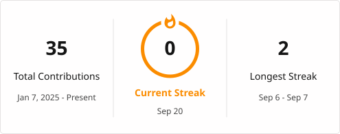

<h1 align="center">Hi 👋, I'm Sahil Dabade!</h1>

<h3 align="center">
Information Technology Student | Developer | AI & ML Enthusiast |  Problem Solver
</h3>

  

---

## 🚀 About Me

* 🎓 I'm a Information Technology student passionate about technology and software development.
* 🔭 Currently working on **AI-powered and web-based projects**.
* 🌱 Currently learning **Artificial Intelligence, Machine Learning, Web Development, and Data Structures & Algorithms**.
* 💡 Interested in building practical solutions using technology.
* 🤝 Open to collaborating on **AI, Web Development, Open Source, and innovative projects**.
* 🛰️ Currently working on **SatQuery AI**, an interactive AI assistant for multimodal remote sensing image analysis.
* 💬 Ask me about **SQL, Firebase, Web Development, DSA, Git, and GitHub**.
* ⚡ Fun fact: I enjoy turning ideas into working projects.

---

## 🛰️ Featured Project

### SatQuery AI

**SatQuery AI** is an interactive Vision-Language Assistant designed for multimodal remote sensing image analysis through natural-language queries.

The goal is to make satellite imagery analysis more accessible by allowing users to interact with remote sensing data using natural language.

---

## 🛠️ Languages and Tools

  <!-- SQL -->
  

  <!-- Firebase -->
  

  <!-- HTML -->
  

  <!-- CSS -->
  

  <!-- JavaScript -->
  

  <!-- DSA -->
  

  <!-- Git -->
  

  <!-- GitHub -->
  

---

## 📊 GitHub Statistics

  

  

---

## 🔥 GitHub Streak

  

---

## 🏆 GitHub Trophies

  

---

## 🐍 My Contributions

  <picture>
    <source
      media="(prefers-color-scheme: dark)"
      srcset="https://raw.githubusercontent.com/SahilDabade/SahilDabade/output/github-contribution-grid-snake-dark.svg"
    />
    <source
      media="(prefers-color-scheme: light)"
      srcset="https://raw.githubusercontent.com/SahilDabade/SahilDabade/output/github-contribution-grid-snake.svg"
    />
    
  </picture>

---

## 🤝 Connect With Me

  

---

<h3 align="center">
⭐ Thanks for visiting my profile!
</h3>
